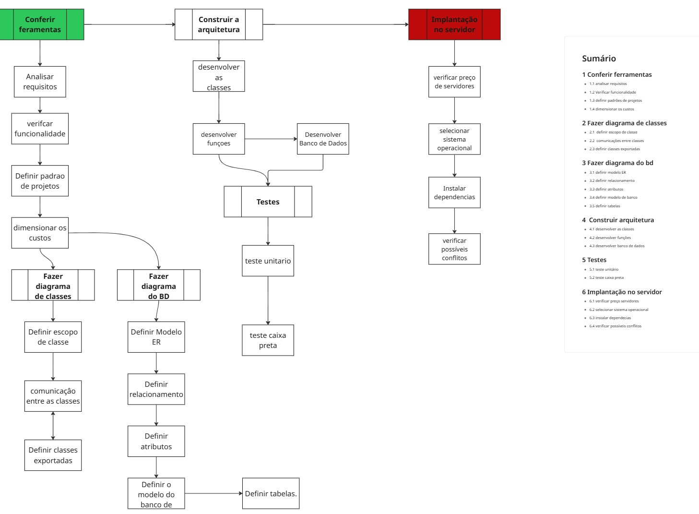

# Diário de Guerra: WhatsApp Booking Bot (De Script Amador a SaaS Multi-tenant)

Este documento é um registro honesto e cronológico da evolução deste projeto. A API em Spring Boot atua como o cérebro de um bot do WhatsApp, consultando e bloqueando datas diretamente no Google Agenda. O objetivo aqui não é apenas mostrar o código pronto, mas documentar os erros graves cometidos no início, os gargalos de infraestrutura enfrentados e como a aplicação foi refatorada utilizando Arquitetura Limpa, Design Patterns e boas práticas de DevOps.

## 🛑 Nota do Autor: A Verdade Sobre o Processo

Bom leve em consideração que esse projeto não está exatamente em ordem cronológica sendo 
que seguindo o diagrama apresentado não era para mim cometer alguns de erros apresentado, inicialmente não segui muito bem uma ordem certa e correta e fui organizando o projeto conforme fui encontrando problemas e percebendo que poderia encontrar barreira futuras, o diagrama por exemplo eu achei legal começar trabalhar em cima quanto mais o projeto cresce mais eu mesmo me perco no meio do códigos por isso apliquei refatoração pesadas no código e comecei a fazer commits a cada mudanças para ter um versionamento melhor e não perca muitos do avanço que eu fiz tendo em vista que commit anterior é muito antigo.

## Diagrama analítico da Arquitetura

Abaixo, o diagrama detalhando uma ideia inicial do projetos sobre o que tinha a ser feito.



## O Plano Original: Premissas e Restrições Iniciais

Antes de escrever a primeira linha de código, o projeto foi idealizado com foco em atender Microempreendedores Individuais (MEIs). Isso moldou as decisões iniciais da arquitetura:

| Categoria | Item | Motivação / Objetivo |
| :--- | :--- | :--- |
| **Premissa** | **Spring Boot** | Framework robusto e conhecido para garantir a estabilidade do backend. |
| **Premissa** | **Evolution API** | Escolhida inicialmente para fazer a ponte rápida com o WhatsApp. |
| **Restrição** | **Custo Baixo** | O sistema precisava rodar em hospedagens baratas para ser comercialmente viável para MEIs. |
| **Restrição** | **Baixa Manutenção** | O bot não poderia quebrar a cada atualização do WhatsApp, exigindo uma solução estável. |
| **Restrição** | **Tempo de Entrega** | Necessidade de validar o MVP (Produto Mínimo Viável) o mais rápido possível. |

--

## 📑 Sumário

1. [Fase 1: O Protótipo Caótico e os "Pecados" de Segurança](#1-fase-1-o-protótipo-caótico-e-os-pecados-de-segurança)
2. [Fase 2: A Fundação, Banco de Dados e Fim do Hardcode](#2-fase-2-a-fundação-banco-de-dados-e-fim-do-hardcode)
3. [Fase 3: A Guerra da RAM, Infraestrutura e WSL2](#3-fase-3-a-guerra-da-ram-infraestrutura-e-wsl2)
4. [Fase 4: Subindo de Nível com Design Patterns (SOLID)](#4-fase-4-subindo-de-nível-com-design-patterns-solid)
5. [Fase 5: Segurança, Assincronismo e Refatoração Final](#5-fase-5-segurança-assincronismo-e-refatoração-final)
6. [Fase 6: Menu/IA](#Fase menu/IA)
7. [Reavaliação: As Premissas vs. A Realidade](#-reavaliação-as-premissas-vs-a-realidade-pós-refatoração)
8. [Diagrama de Classes: A Estrutura do SaaS Multi-tenant](#-diagrama-de-classes-a-estrutura-do-saas-multi-tenant)


---

## 1. Fase 1: O Protótipo Caótico e os "Pecados" de Segurança <a name="1-fase-1-o-protótipo-caótico-e-os-pecados-de-segurança"></a>

O início do projeto foi marcado por decisões que visavam apenas "fazer funcionar", ignorando boas práticas e criando um pesadelo de segurança e manutenção. 

**Exposição de Chaves e IDs:** Em commits iniciais, cometi o erro gravíssimo de subir as credenciais do Google Cloud para o repositório público e expor o ID da agenda de clientes[chaves precisaram ser revogadas e o arquivo `credentials.json` devidamente isolado na pasta `resources` com proteção no `.gitignore`.
* **Banco de Dados sem Senha:** A primeira versão de persistência subiu completamente desprotegida, um erro inaceitável para qualquer aplicação real.
**O Reino do Hardcode:** O texto do menu principal estava escrito diretamente dentro da classe `ControllerWhatsapp.java`.A ID da agenda estava engessada no `application.properties`. Demorei para limpar esse vício, o que impedia totalmente o sistema de atender mais de um cliente.
**Instabilidade de Framework:** O projeto começou no Spring Boot 4.1.10 (instável), exigindo uma migração precoce para a versão estável 3.4.3 e forçando um aprendizado sobre nomenclatura e versionamento correto no `pom.xml`.

## 2. Fase 2: A Fundação, Banco de Dados e Fim do Hardcode <a name="2-fase-2-a-fundação-banco-de-dados-e-fim-do-hardcode"></a>

Para transformar o script em um projeto real (SaaS), o código "chumbado" precisou ser erradicado.

**PostgreSQL Dockerizado:** Subimos um banco relacional profissional via Docker, com senhas e volumes configurados corretamente.
**Multi-tenant Roteamento Inteligente:** O Java agora cria tabelas (`Empresa`, `Menu`, `Fluxo_Conversa`) via Hibernate. Quando o Webhook recebe uma mensagem, ele consulta dinamicamente o banco para identificar o cliente e isolar a conversa, impedindo que os dados da "Empresa A" vazem para a "Empresa B".
**Sanitização de Dados:** Durante os testes, o banco foi inundado com "empresas fantasmas" (dados nulos) devido a um erro de referência em um método. O banco precisou ser limpo para restabelecer a integridade.

## 3. Fase 3: A Guerra da RAM, Infraestrutura e WSL2 <a name="3-fase-3-a-guerra-da-ram-infraestrutura-e-wsl2"></a>

## 🛑 Nota do Autor
   Foi necessário colocar os arquivos do wppconnect direto no github para facilitar meu trabalho não precisar fazer a modificação aplicada de novo no servidor, o problema seria que quando eu desligo a sessão o chrome sempre deixa lixo da sessão passada sempre retornando **erro 21** no wpp para evitar sempre esse trabalho manual tive que colocar um script de limpeza para agilizar o processo.
   
   A comunicação com o WhatsApp trouxe os maiores desafios de infraestrutura. A escolha de manter a API do **WPPConnect** (que opera via WhatsApp Web) custou caro em processamento, mas garantiu menor necessidade de manutenção a longo prazo.

* **Migração de I/O (O Fim das Travas):** O bot rodava em pastas do Windows (`C:\`), causando extrema lentidão. A migração para o sistema de arquivos nativo do Linux (WSL2) trouxe uma velocidade brutal para a aplicação.
**Erro SIGTERM e Consumo de Memória:** O container do bot morria constantemente O diagnóstico revelou que o Linux matava o processo por falta de memória compartilhada para o Chrome interno.
**A Cura pelo Docker:** Ajustamos o `docker-compose.yml` de forma profissional, aplicando `shm_size: '2gb'` para dar fôlego ao bot, configurando uma `SERVER_URL` interna para evitar erros de rotas cegas e adotando Volumes Nomeados.

## 4. Fase 4: Subindo de Nível com Design Patterns (SOLID) <a name="4-fase-4-subindo-de-nível-com-design-patterns-solid"></a>

Com a infraestrutura estabilizada, o código precisou ser limpo. A lógica misturava regras de negócio com requisições HTTP. Aplicamos o padrão ouro da engenharia (SOLID).

**Separação de Responsabilidades:** * A Recepcionista (`ControllerWhatsapp`): Apenas recebe as requisições na porta principal.
   O Especialista (`ServicoLocacao`): O cérebro que aplica regras de negócio.
   O Carteiro (`MensageriaService`): O único ponto que conversa com o WPPConnect para despachar mensagens.
**Padrão Strategy e Factory:** Criamos a interface `ModuloAtendimentoStrategy`. Isso abriu o sistema para extensão (Open/Closed Principle). Agora, para adicionar uma Barbearia, o Webhook não muda; basta criar uma `BarbeariaStrategy` e o `ModuloFactory` injeta o comportamento correto dinamicamente.

## 5. Fase 5: Segurança, Assincronismo e Refatoração Final <a name="5-fase-5-segurança-assincronismo-e-refatoração-final"></a>

Os últimos passos focaram em preparar a aplicação para um ambiente de produção seguro e performático.

* **Segurança de Endpoints:** O `ControllerEmpresa` estava com as portas escancaradas. Protegemos as rotas adicionando autenticação via Token no Header e separamos rigidamente as criações (`@PostMapping`) das atualizações (`@PutMapping`) para evitar sobrescritas.
**Gargalo do Hibernate:** Corrigimos o erro de `LazyInitializationException` no `ServicoMenu` utilizando `@Transactional`, impedindo que o Spring fechasse a conexão antes de puxar as listas de relacionamento das entidades.
**Padrão Singleton no Google API:** O bot sofria gargalos lendo o arquivo físico `credentials.json` a cada requisição. Refatoramos para que o Spring carregue o arquivo apenas uma vez na inicialização, mantendo a autenticação ativa na RAM.
* **Padrão Observer e `@Async`:** Para evitar que o bot do WhatsApp ficasse "pensando" (bloqueando a thread) enquanto a API do Google processava a reserva, implementamos eventos assíncronos. O `LocacaoStrategy` dispara o evento `EventoReservaConfirmada` para o cliente instantaneamente, enquanto o `ObservadorGoogleAgenda` salva a reserva nos bastidores de forma assíncrona.

## 6. Fase 6:Menu/IA <a name="Fase menu/IA"></a>
* **Menu** = A ideia que tem um necessidade de agenda bem simplificado vamos oferecer um plano que gerar o menu de acordo com o que pessoa marcou que usar no banco de dados, è necessário trabalhar num front para cliente ter uma liberdade de escolha.
* **IA** = Quero oferecer um misto se a pessoa responder de acordo com as opções disponíveis, vamos para caminho padrão caso vir uma frase mais fora do comum entramos com a **IA**isso pensando na economia de token.

## 🔄 Reavaliação: As Premissas vs. A Realidade (Pós-Refatoração)

À medida que o sistema evoluiu de um script simples para um modelo SaaS Multi-tenant, o plano original sofreu impactos diretos da infraestrutura. Veja como as premissas se transformaram:

| Categoria | O que mudou? | A Nova Realidade (Solução Aplicada) |
| :--- | :--- | :--- |
| **Premissa** | **Spring Boot** (Atualizado) | Mantido, mas forçou a migração da versão 4.1.10 (instável) para a **v3.4.3**, exigindo refatoração estrutural. |
| **Premissa** | **Evolution API** ➡️ **WPPConnect** | A Evolution consumia muita RAM. O WPPConnect foi adotado porque, com apenas uma conexão, consegue isolar e atender vários clientes (Multi-tenant) com manutenção baixíssima. |
| **Restrição** | **Custo vs. Limite de RAM** | Para manter o custo baixo na Hostinger sem o servidor "estourar" a RAM, aplicamos o encapsulamento via **Docker** (`shm_size: 2gb`). |
| **Restrição** | **Tempo vs. Qualidade** | O MVP rápido gerou dívida técnica (Hardcode e falhas de segurança). O tempo foi reinvestido para aplicar Padrões de Projeto (SOLID, Strategy). |
| **Restrição** | **Escala para MEIs** | O sistema agora é verdadeiramente escalável. A adição do **PostgreSQL** permite cadastrar infinitos MEIs sem alterar o código-fonte. |

---

## Diagrama de Classes: A Estrutura do SaaS Multi-tenant

Para exemplificar a refatoração pesada aplicada na Fase 4, este diagrama detalha a visão estrutural do projeto após a implementação dos padrões Strategy e Factory. Ele ilustra como garantimos a escalabilidade e o isolamento de dados de cada cliente (MEI):

```mermaid
classDiagram
    class WebhookHandler {
        - payload : Map~String,Object~
        + WebhookHandler(payload : Map~String,Object~)
        + getRemoteJid() : String
        + getTextoMensagem() : String
    }

    class DiaReservaDTO {
        + data : String
        + diaDaSemana : String
        + status : String
    }

    class EstadoUsuario {
        - fase : String
        - ultimaInteracao : long
        + EstadoUsuario(fase : String, ultimaInteracao : long)
        + getFase() : String
        + getUltimaInteracao() : long
    }

    class ServicoMenu {
        + montarMenuPrincipal(empresa : Empresa) : String
        + descobrirAcao(empresa : Empresa, numeroDigitado : String) : String
    }

    class GerenciadorSessao {
        - TEMPO_EXPIRACAO_MS : long = 10*60*1000
        + obterEstadoAtual(numeroCliente : String) : String
        + atualizarEstado(numeroCliente : String, novaFase : String) : void
    }

    class LocacaoStrategy {
        + getRamoDeAtuacao() : String
        + processarMensagem(empresa : Empresa, numeroCliente : String, textoRecebido : String, estadoAtual : String) : void
    }

    class FactoryModulo {
        + FactoryModulo(listaDeEstrategias : List~ModuloAtendimentoStrategy~)
        + obterEstrategia(ramo : String) : ModuloAtendimentoStrategy
    }

    class ControllerWhatsapp {
        + receberMensagem(payload : Map~String,Object~) : ResponseEntity~Void~
    }

    class ControllerEmpresa {
        - adminApiKey : String
        - isAcessoNegado(tokenRecebido : String) : boolean
        + cadastrarEmpresa(token : String, novaEmpresa : Empresa) : ResponseEntity~String~
        + atualizarEmpresa(token : String, dadosAtualizados : Empresa) : ResponseEntity~String~
    }

    class MensagemWhatsappDTO {
        + numero : String
        + nome : String
        + texto : String
    }

    class ServicoGoogleagenda {
        + inicializarAgenda() : void
        + conectarAgenda() : Calendar
    }

    class ServicoReserva {
        + agendarNoGoogle(empresa : Empresa, dataReserva : String, nomeCliente : String) : void
        + listarReservas(empresa : Empresa) : List~DiaReservaDTO~
        + pesquisarData(empresa : Empresa, dataRecebida : String) : DiaReservaDTO
    }

    class ObservadorGoogleAgenda {
        + registrarNoGoogle(evento : EventoReservaConfirmada) : void
    }

    class HorarioReserva {
        - id : Long
        - descricao : String
        - status : String
        - valor : String
        + getId() : Long
        + setId(id : Long) : void
        + getDescricao() : String
        + setDescricao(descricao : String) : void
        + getStatus() : String
        + setStatus(status : String) : void
        + getDia() : DiaReserva
        + setDia(dia : DiaReserva) : void
        + getValor() : String
        + setValor(valor : String) : void
    }

    class DiaReserva {
        - id : Long
        - data : String
        + getId() : Long
        + setId(id : Long) : void
        + getData() : String
        + setData(data : String) : void
        + getEmpresa() : Empresa
        + setEmpresa(empresa : Empresa) : void
        + getHorariosDisponiveis() : List~HorarioReserva~
        + setHorariosDisponiveis(horariosDisponiveis : List~HorarioReserva~) : void
    }

    class Empresa {
        - id : Long
        - nome : String
        - usaIA : Boolean = false
        - sessaoWhatsapp : String
        - mensagemSaudacao : String
        - ramoDeAtuacao : String
        - tabelaDePrecos : String
        - linkGoogleMaps : String
        - linkFotoPrincipal : String
        - linkGaleria : String
        - googleCalendarId : String
        - locacaoPorHora : Boolean = false
        + getUsaIA() : Boolean
        + setUsaIA(usaIA : Boolean) : void
        + getLocacaoPorHora() : Boolean
        + setLocacaoPorHora(locacaoPorHora : Boolean) : void
        + getModulosAtivos() : List~ModuloEmpresa~
        + setModulosAtivos(modulosAtivos : List~ModuloEmpresa~) : void
        + getGoogleCalendarId() : String
        + setGoogleCalendarId(googleCalendarId : String) : void
        + getNome() : String
        + setNome(nome : String) : void
        + getId() : Long
        + setId(id : Long) : void
        + getMensagemSaudacao() : String
        + setMensagemSaudacao(mensagemSaudacao : String) : void
        + getSessaoWhatsapp() : String
        + setSessaoWhatsapp(sessaoWhatsapp : String) : void
        + getRamoDeAtuacao() : String
        + setRamoDeAtuacao(ramoDeAtuacao : String) : void
        + getDiasDeReserva() : List~DiaReserva~
        + getTabelaDePrecos() : String
        + setTabelaDePrecos(tabelaDePrecos : String) : void
        + setDiasDeReserva(diasDeReserva : List~DiaReserva~) : void
        + getLinkGoogleMaps() : String
        + setLinkGoogleMaps(linkGoogleMaps : String) : void
        + getLinkFotoPrincipal() : String
        + setLinkFotoPrincipal(linkFotoPrincipal : String) : void
        + getLinkGaleria() : String
        + setLinkGaleria(linkGaleria : String) : void
    }

    class ModuloEmpresa {
        - id : Long
        - codigoAcao : String
        - textoMenu : String
        - ordemExibicao : Integer
        - ativo : Boolean = true
        + getId() : Long
        + setId(id : Long) : void
        + getEmpresa() : Empresa
        + setEmpresa(empresa : Empresa) : void
        + getCodigoAcao() : String
        + setCodigoAcao(codigoAcao : String) : void
        + getTextoMenu() : String
        + setTextoMenu(textoMenu : String) : void
        + getOrdemExibicao() : Integer
        + setOrdemExibicao(ordemExibicao : Integer) : void
        + getAtivo() : Boolean
        + setAtivo(ativo : Boolean) : void
    }

    %% Relacionamentos de Serviços e Controladores
    ControllerWhatsapp --> GerenciadorSessao : - gerenciadorSessao
    ControllerWhatsapp --> FactoryModulo : - moduloFactory
    GerenciadorSessao --> EstadoUsuario : - sessoes
    
    LocacaoStrategy --> ServicoMenu : - servicoMenu
    LocacaoStrategy --> GerenciadorSessao : - gerenciadorSessao
    LocacaoStrategy --> ServicoReserva : - servicoReserva
    
    ServicoReserva --> ServicoGoogleagenda : - agendaService
    ObservadorGoogleAgenda --> ServicoMensagem : - servicoMensagem

    %% Relacionamentos de Entidades (Bidirecionais explícitos e limpos)
    DiaReserva "1" --> "*" HorarioReserva : - horariosDisponiveis
    HorarioReserva --> "1" DiaReserva : - dia

    Empresa "1" --> "*" DiaReserva : - diasDeReserva
    DiaReserva --> "1" Empresa : - empresa

    Empresa "1" --> "*" ModuloEmpresa : - modulosAtivos
    ModuloEmpresa --> "1" Empresa : - empresa

````
